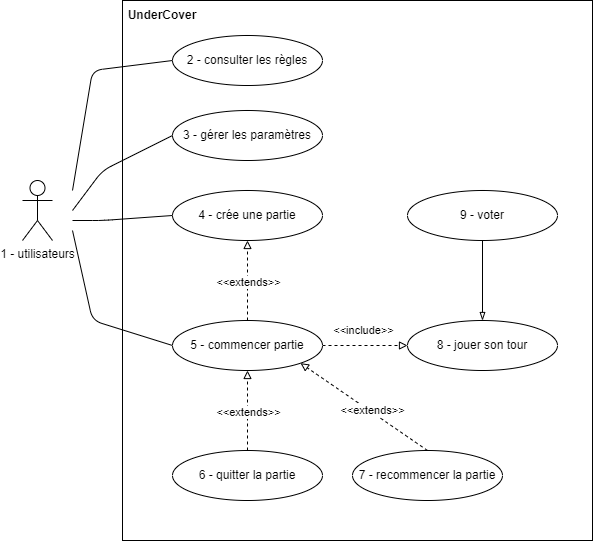

# **<u>Polar Investigation</u>**

<u>Projet de SAE2.01 développement d'une application</u>

### **Groupe :**  
Simoni Kachidze 
Megane Martin 
Auguste Fleury 

# <a href="https://codefirst.iut.uca.fr/git/auguste.fleury/Undercover/wiki/Home"> Lien sur le Wiki </a>

 
 

# Sommaire :

- [Sketch et Storyboard](#Sketch)
- [Notice du jeu](#Notice)
    - [Avant de commencer](#Start)
    - [Phase du jeu](#Phase)
    - [Condition de victoire](#Condition)
- [Contexte](#Contexte)
- [Diagramme](#Diagramme)
    - [Diagramme de cas d'utilisation](#useCase)

###################################################################################

<a name="Sketch">

# Sketches et Storyboards :

Les sketches et les Storyboards sont dans le wiki :

Sketches: [https://codefirst.iut.uca.fr/git/auguste.fleury/Undercover/wiki/Sketch](https://codefirst.iut.uca.fr/git/auguste.fleury/Undercover/wiki/Sketch)

Storyboards: [https://codefirst.iut.uca.fr/git/auguste.fleury/Undercover/wiki/Storyboard](https://codefirst.iut.uca.fr/git/auguste.fleury/Undercover/wiki/Storyboard)

</a>
<a name="Notice">

# Notice du jeu :
Dans un premier temps, il est nécessaire d'avoir un seul ordinateur afin de jouer. De manière "passe et joue".

</a>
<a name="Start">

## Avant de commencer
**Polar Investigation** est un jeu qui joue sur les mots ☺.  
Un petit groupe d’Imposteurs s’est infiltré sur une île tropicale, où tout le monde (y compris les Imposteurs) a oublié son identité.
Les seuls indices disponibles pour se rappeler qui on est sont des mots secrets reçus par chacun. Votre but est de découvrir ceux qui ont le même mot que vous et de vous entraider pour expulser les autres de l’île !

### Il y a trois types de rôle :

**Les Civils :** Leur but est de découvrir leur propre identité et d'éliminer l’Undercover & Mr. White.

**L’Undercover :** Son but est de découvrir sa propre identité et de survivre jusqu’à la fin.

**Le Mr. White :** Son but est de survivre jusqu’à la fin ou de deviner le mot secret des Civils.

### Déroulement du jeu
Chaque partie est basée sur une paire de mots assez proches (par exemple « chat » et « chien »). Au début de la partie, chacun reçoit l’un de ces mots excepté le Mr. White.

GARDEZ PRÉCIEUSEMENT VOTRE MOT SECRET !!!

</a>
<a name="Phase">

## Phase du jeu
Il y a 3 phases principales dans le jeu. Après un cycle des 3 phases, un joueur est éliminé de l’île. Répétez ce cycle autant de fois que nécessaire jusqu’à ce que l’un des groupes (Civils, Undercovers ou Mr. Whites) gagne.

### Phase de Description

Dès que chacun a reçu son mot secret, un joueur est désigné aléatoirement pour commencer à décrire son mot secret. Un par un, chacun décrit son mot avec un mot ou une courte phrase. Mr. White doit improviser, puisqu’il/elle n’a pas de mot secret.

Utilisez cette phase pour révéler assez d’informations pour trouver vos alliés, mais pas trop pour éviter que Mr. White ne devine le mot.

### Phase de Discussion

Une fois la phase de description terminée, les joueurs discutent et débattent sur qui, selon eux, sont les Civils ou les Imposteurs.

Les Civils et les Undercovers doivent utiliser cette phase pour rassembler des indices sur leur identité, construire des alliances et identifier leurs ennemis. Pendant ce temps, pour Mr. White c’est le moment idéal pour essayer d’en apprendre plus sur le mot des Civils.

Un conseil : ne vous exposez pas trop tôt ! Utilisez votre charme pour faire pencher la balance en votre faveur.

### Phase d’Élimination

Une fois la discussion terminée, les joueurs restants votent pour éliminer un joueur de leur choix. Rappelez-vous, les joueurs éliminés ne peuvent plus voter.

Le joueur qui a reçu le plus de votes est expulsé de l’île ! À moins que le joueur en question ne soit Mr. White !… Dans ce cas, il/elle a encore une chance de deviner le mot des Civils. S’il/elle devine le mot des Civils correctement, Mr. White gagne **immédiatement**.

Si après l’élimination, les conditions de victoire indiquées ci-dessous ne sont pas remplies, répétez les 3 phases jusqu’à ce que l’un des groupes (Civils, Undercovers ou Mr. Whites) gagne.

</a>
<a name="Condition">

## Conditions de Victoire
**Les Civils** gagnent s’ils éliminent tous les Undercovers et les Mr. Whites.

**Les Imposteurs** (Undercovers et/ou Mr. Whites) gagnent s’ils survivent jusqu’à ce qu’il ne reste plus qu’1 Civil.

**Mr. White** gagne aussi s’il/elle devine le mot secret des Civils.

En cas de victoire, les Civils marquent tous 2 points, Mr. White, 6 points et l’Undercover, 10 points !

</a>
<a name="Contexte">

# Contexte

Dans un premier temps, notre application a pour but de divertir au maximum nos utilisateurs. À travers le jeu qu'est **Polar Investigation**.

Le jeu est simple le but est de soit éléminer les méchants ou de rester en vie jusqu'à la fin (*Undercover et Mr.White*) ou de trouver le mots des civils (*Mr.White*). La partie commencent tous les joueurs recoivent un mots excepté le(s) **Mr.White** un round se déroule avec un ordre de passage. L'ordre de passage est donné par l'application et chacun des joueurs doivent dire un mot qu'il pensent être en rapport avec celui des civils chacun leur tour. Pour s'aider les **civils** reçoivent le mots en question, le(s) **Undercover** recoivent un mot en rapport et le(s) **Mr.WHite** ne peuvent pas passer en premier. 

Cet aplication est dévloppé de manière à être utilsé par tous et est spécialement conçu pour être utilisé sur des ordinateurs de bureau ou des ordinateurs portables.

### Gestion des rôles :

L'application attribue aléatoirement des rôles à chaque joueur avec pour rôle : **l'Undercover, le Mr. White et les Civils**. En revanche, excepté le **Mr. White**, personne ne connaît son rôle.

### Notre interface :

Notre interface est conçue de manière à ce que tout le monde puisse l'utiliser, de manière simple et intuitive. Même un enfant est en mesure de l'utiliser

### Mode de jeu :

Le jeu se joue de manière **locale** avec tout le monde sur le même écran. Les joueurs peuvent alors choisir le nombre de joueurs par partie ainsi que le nombre de rôles.

### Personnalisation visuelle :

Les joueurs peuvent personnaliser l'apparence de l'interface en choisissant leur thème Windows entre le thème sombre et le thème clair.

## Nos conseils en tant que joueurs

D'après nous, il est nécessaire de saisir certaines particularités du jeu telles que la nuance entre les différents rôles.

Seul le(s) **Mr. White** est au courant de son rôle. Sa tâche est donc de se fondre au maximum dans la masse parmi les **Civils** en disant un mot qui ressemble au mot de ceux qu'ils pensent être celui des Civils.

**! Lors des parties avec de nombreux joueurs, il est possible d'avoir plusieurs _Mr. White_ et plusieurs _Undercovers_ !**

Pour les autres joueurs, le doute de ne pas être **civil** est présent jusqu'à l'élimination de tous les **Undercovers**. Ainsi il est nécessaire d'adpter sa manière de jouer et de se préparer à d'éventuel trahison.

# Diagramme

## Diagramme de cas d'utilisation

### 1 - << utilisateurs >>
Les utilisateurs peuvent être n'importe qui, mais il faut avoir au moins 3 personnes pour jouer.

### Cas 2 - << consulter les règles >>
|||
-|-
**Nom**|consulter les règles
**Objectif**|faire connaître les règles à des joueurs qui ne les connaissent pas
**Acteurs principaux**|personne qui ne connaît pas les règles du jeu
**conditions initiales**| - joueur doit être connecté à l'application   - joueur doit cliquer sur le bouton de règles
**scénario d'utilisation**| - joueurs lisent les règles   - joueurs reviennent au menu principal une fois qu'il a fini de lire les règles
**conditions de fin**| - Joueur a bien lu les règles et maintenant il reviendra sur le menu   - joueur a lu à moitié et il revient sur le menu sans savoir jouer

### Cas 3 - << gérer les paramètres >>
|||
----- | ----
**Nom**  |  gérer les paramètres
**Objectif**  |  fixer les paramètres souhaités pour le confort des joueurs
**Acteurs principaux**  |  Des joueurs capricieux
**conditions initiales**  |  - joueur doit être connecté à l'application   - joueur doit cliquer sur le bouton de paramètres
**scénario d'utilisation**  |  - joueur règle les paramètres   - joueur revient sur le menu
**conditions de fin**  |  - joueur a pu fixer l'application à son désir   - joueur n'est pas satisfait donc il peut mal nous noter

  

### Cas 4 - << créer une partie >>
|||
-|-
**Nom**|créer une partie
**Objectif**|créer une partie d'Undercover et fixer les options
**Acteurs principaux**|joueur qui va créer une partie
**Acteurs secondaires**|Les certaines contraintes près définies qui permettent de ne pas faire n'importe quoi (exemple: s'il y a 3 joueurs, 2 sont forcément civils, 1 undercover et 0 M. White etc.)
**conditions initiales**| - le joueur commence une partie   - joueur à 2 amis minimum et (19 maximum)
**scénario d'utilisation**| - joueur choisit le nombre de joueurs   - joueur personnalise la proportion des personnages
**conditions de fin**| - joueur démarre une partie   - joueur n'a pas assez d'amis pour jouer   - joueur n'a plus envie de jouer ou il a oublié quelque chose donc il retourne sur le menu

  

### Cas 5 - << commencer partie >>
|||
-|-
**Nom**|commencer partie
**Objectif**| Personnaliser son personnage (photo et surnom) et commencer à jouer !!!!
**Acteurs principaux**|les joueurs de la partie
**conditions initiales**|- il y a déjà une partie qui est créée avec le nombre de personnages choisis   - il y a un groupe de 3-20 amis qui sont déjà prêts à jouer
**scénario d'utilisation**|- les joueurs choisissent leur surnom   les joueurs choisissent leur photo ou avatar   - les joueurs commencent à jouer
**conditions de fin**|- les joueurs ont fait la personnalisation de leurs personnages et commencent à jouer   - ils ont décidé de ne plus jouer et ils ont quitté la partie

  

### Cas 6 - << quitter la partie >>
|||
-|-
**Nom**|quitter la partie
**Objectif**|Permettre aux joueurs de quitter quand ils n'ont plus envie de jouer
**Acteurs principaux**|joueurs qui ne veulent plus jouer
**conditions initiales**|- les joueurs sont en train de jouer, la partie est démarrée
**scénario d'utilisation**|- les joueurs ne veulent plus passer de temps devant l'écran et ils quittent la partie pour prendre l'air   il y a eu un problème donc ils ont envie de recommencer la partie   la partie est finie et les joueurs ont envie de quitter
**conditions de fin**|- les joueurs ont quitté la partie, partie terminée et détruite   joueurs ont fini la partie et ils sont partis

  

### Cas 7 - << recommencer la partie >>
|||
-|-
**Nom**|recommencer la partie
**Objectif**|Recommencer la partie sans revenir au menu de départ, pour recommencer rapidement après la fin ou au milieu de la partie
**Acteurs principaux**|les joueurs qui ont envie de recommencer la partie
**conditions initiales**|- la partie est en train de tourner
**scénario d'utilisation**|- les joueurs ont envie de recommencer car il y a une fuite d'information sur le mot d'un joueur   Ils ont fini une partie et ils ont tellement été impressionnés qu'ils ont envie de recommencer
**conditions de fin**|- ils ont recommencé la partie ensuite

  

### Cas 8 - << jouer son tour >>
|||
-|-
**Nom**|jouer son tour
**Objectif**|jouer à son tour
**Acteurs principaux**|joueur qui doit jouer son tour
**conditions initiales**|- les autres ont joué et tout est venu pour joueur n
**scénario d'utilisation**|- joueur joue à son tour et clique suivant
**conditions de fin**|- Tout est joué et prochain doit jouer   - c'était le dernier joueur et maintenant il faut voter

  

### Cas 9 - << voter >>
|||
-|-
**Nom**|voter
**Objectif**|voter pour ceux que les joueurs pensent être undercover
**Acteurs principaux**|Tous les joueurs
**Acteurs secondaires**|la tour de vote
**conditions initiales**|- tout le monde a joué à la partie
**scénario d'utilisation**|- joueur vote pour ce qu'il pense être undercover
**conditions de fin**|- le vote est fait et un joueur quitte la partie (cela peut être les trois personnages) et le jeu continue   - il ne reste plus d'undercover donc les civils ont gagné -   il ne reste qu'un civil donc les undercovers ont gagné   - M. White quitte le jeu et dit qu'il pensait être undercover

