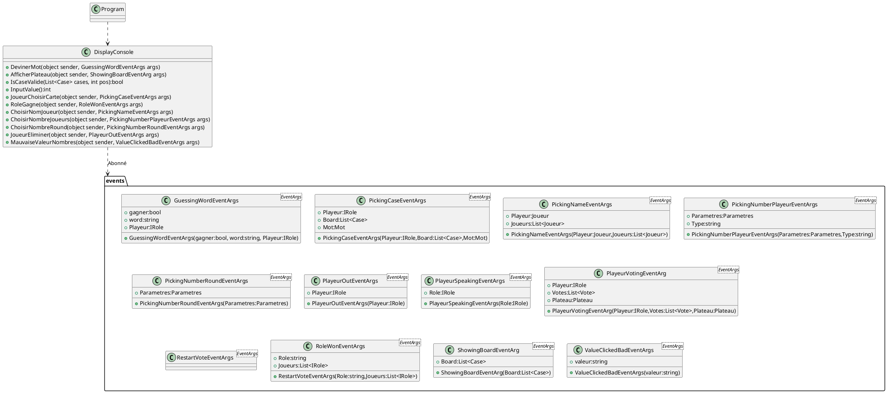

```plantuml
@startuml
package events <<Folder>>{
Class GuessingWordEventArgs <EventArgs>{
    + gagner:bool
    + word:string
    + Playeur:IRole
    +GuessingWordEventArgs(gagner:bool, word:string, Playeur:IRole)
}

class PickingCaseEventArgs<EventArgs>{
    +Playeur:IRole
    +Board:List<Case>
    +Mot:Mot
    +PickingCaseEventArgs(Playeur:IRole,Board:List<Case>,Mot:Mot)
}

class PickingNameEventArgs<EventArgs>{
    +Playeur:Joueur
    +Joueurs:List<Joueur>
    +PickingNameEventArgs(Playeur:Joueur,Joueurs:List<Joueur>)
}

class PickingNumberPlayeurEventArgs<EventArgs>{
    +Parametres:Parametres
    +Type:string
    +PickingNumberPlayeurEventArgs(Parametres:Parametres,Type:string)
}

class PickingNumberRoundEventArgs<EventArgs>{
    +Parametres:Parametres
    +PickingNumberRoundEventArgs(Parametres:Parametres)
}

class PlayeurOutEventArgs<EventArgs>{
    +Playeur:IRole
    +PlayeurOutEventArgs(Playeur:IRole)
}

class PlayeurSpeakingEventArgs<EventArgs>{
    +Role:IRole
    +PlayeurSpeakingEventArgs(Role:IRole)
}

class PlayeurVotingEventArg<EventArgs>{
    +Playeur:IRole
    +Votes:List<Vote>
    +Plateau:Plateau
    +PlayeurVotingEventArg(Playeur:IRole,Votes:List<Vote>,Plateau:Plateau)
}

class RestartVoteEventArgs<EventArgs>{}

class RoleWonEventArgs<EventArgs>{
    +Role:string
    +Joueurs:List<IRole>
    +RestartVoteEventArgs(Role:string,Joueurs:List<IRole>)
}

class ShowingBoardEventArg<EventArgs>{
    +Board:List<Case>
    +ShowingBoardEventArg(Board:List<Case>)
}

class ValueClickedBadEventArgs<EventArgs>{
    +valeur:string
    +ValueClickedBadEventArgs(valeur:string)
}

}
Class DisplayConsole{
    +DevinerMot(object sender, GuessingWordEventArgs args)
    +AfficherPlateau(object sender, ShowingBoardEventArg args)
    +IsCaseValide(List<Case> cases, int pos):bool
    +InputValue():int
    +JoueurChoisirCarte(object sender, PickingCaseEventArgs args)
    +RoleGagne(object sender, RoleWonEventArgs args)
    +ChoisirNomJoueur(object sender, PickingNameEventArgs args) 
    +ChoisirNombreJoueurs(object sender, PickingNumberPlayeurEventArgs args)
    +ChoisirNombreRound(object sender, PickingNumberRoundEventArgs args)
    +JoueurEliminer(object sender, PlayeurOutEventArgs args)
    + MauvaiseValeurNombres(object sender, ValueClickedBadEventArgs args)


}

Class Program{}

DisplayConsole ..> events :Abonné
Program ..> DisplayConsole 
@enduml
```