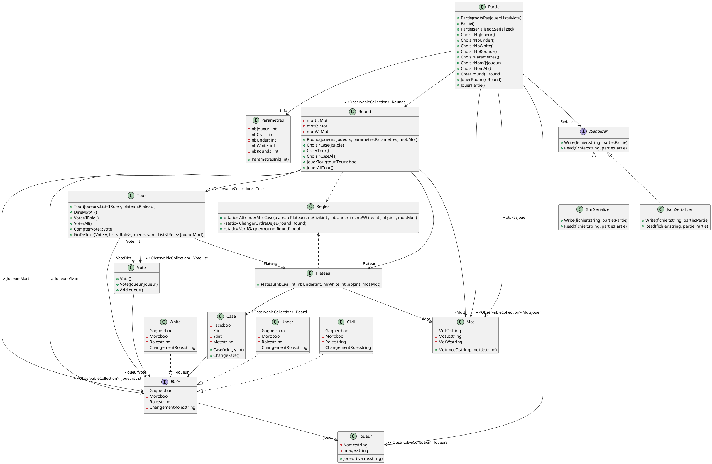

```plantuml
@startuml


Class Partie {
    +Partie(motsPasJouer:List<Mot>)
    +Partie()
    +Partie(serialized:ISerialized)
    +ChoisirNbJoueur()
    +ChoisirNbUnder()
    +ChoisirNbWhite()
    +ChoisirNbRounds()
    +ChoisirParametres()
    +ChoisirNom(j:Joueur)
    +ChoisirNomAll()
    +CreerRound():Round
    +JouerRound(r:Round)
    +JouerPartie()

}

Class Parametres{
    -nbJoueur: int
    -nbCivils: int
    -nbUnder: int
    -nbWhite: int
    -nbRounds: int
    +Parametres(nbJ:int)
}

Class Round{
    -motU: Mot
    -motC: Mot
    -motW: Mot
    +Round(joueurs:Joueurs, parametre:Parametres, mot:Mot)
    +ChoisirCase(j:IRole)
    +CreerTour()
    +ChoisirCaseAll()
    +JouerTour(tour:Tour): bool
    +JouerAllTour()
}

Class Plateau{
    
    +Plateau(nbCivil:int, nbUnder:int, nbWhite:int ,nbJ:int, mot:Mot)
}

Class Joueur{
    -Name:string
    -Image:string
    +Joueur(Name:string)
}

Class Mot{
    - MotC:string
    - MotU:string
    - MotW:string
    + Mot(motC:string, motU:string)
}

Class Vote{
    
    +Vote()
    +Vote(Joueur joueur)
    +AddJoueur()
}

Class Case {
    - Face:bool
    - X:int
    - Y:int
    - Mot:string
    + Case(x:int, y:int)
    + ChangeFace()
}

Class Tour{
    +Tour(Joueurs:List<IRole>, plateau:Plateau )
    +DireMotAll()
    +Voter(IRole j)
    +VoterAll()
    +CompterVote():Vote
    +FinDeTour(Vote v, List<IRole> Joueurvivant, List<IRole> JoueurMort)
}

Interface IRole{
    - Gagner:bool
    - Mort:bool
    - Role:string
    - ChangementRole:string
}

static Class  Regles{
    + <<static>> AttribuerMotCase(plateau:Plateau , nbCivil:int ,  nbUnder:int, nbWhite:int , nbJ:int , mot:Mot )
    + <<static>> ChangerOrdreDeJeu(round:Round)
    + <<static>> VerifGagner(round:Round):bool

}

Interface ISerializer{
    + Write(fichier:string, partie:Partie)
    + Read(fichier:string, partie:Partie)
}

Class JsonSerializer{
    + Write(fichier:string, partie:Partie)
    + Read(fichier:string, partie:Partie)
}

Class XmlSerializer{
    + Write(fichier:string, partie:Partie)
    + Read(fichier:string, partie:Partie)
}


Class White{
    - Gagner:bool
    - Mort:bool
    - Role:string
    - ChangementRole:string
}
Class Under{
    - Gagner:bool
    - Mort:bool
    - Role:string
    - ChangementRole:string
}
Class Civil{
    - Gagner:bool
    - Mort:bool
    - Role:string
    - ChangementRole:string
}

ISerializer <|..XmlSerializer
ISerializer <|..JsonSerializer


Partie --> "* <ObservableCollection> -Rounds" Round
Partie --> "-info" Parametres
Partie --> "* <ObservableCollection>-Joueurs" Joueur
Partie -->  Mot :MotsPasJouer
Partie --> "* <ObservableCollection>-MotsJouer" Mot
Partie --> "-Serialized" ISerializer

Round --> "-Plateau" Plateau
Round --> "* <ObservableCollection> -Tour" Tour
Round   --> IRole:*-JoueursVivant
Round --->  IRole:*-JoueursMort
Round --> " -Mott" Mot
Round ..> Regles

Plateau  --> "* <ObservableCollection> -Board" Case
Plateau --> "-Mot" Mot

Case --> "-Joueur" IRole

Tour  --> "* <ObservableCollection> -JoueursList" IRole
Tour  [Vote,int] --> "VoteDict " Vote
Tour   --> "* <ObservableCollection> -VoteList " Vote
Tour --> "-Plateau" Plateau


Regles <..Plateau

Vote  --> "-JoueurVote" IRole

IRole --> "-Joueur" Joueur

White ..|> IRole
Under ..|> IRole
Civil ..|> IRole


@enduml
```