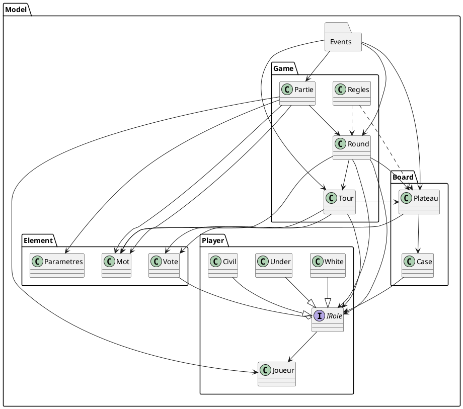

```plantuml
@startuml


package Model <<Folder>>{

package Game <<Folder>>{
    Class Partie 
    Class Round
    Class Tour
    static Class  Regles
}

package Board <<Folder>>{
   Class Case 
   Class Plateau
}
package Element <<Folder>>{
    Class Parametres
    Class Mot
    Class Vote
}

package Player <<Folder>>{
    Class Joueur
    Interface IRole
    Class White
    Class Under
    Class Civil

}
package Events <<Folder>>{

}
}

Events --> Round
Events --> Plateau
Events --> Partie
Events --> Tour


Partie --> Round
Partie -->  Parametres
Partie -->  Joueur
Partie -->  Mot 
Partie -->  Mot


Round -->  Plateau
Round -->  Tour
Round   --> IRole
Round --->  IRole
Round -->  Mot

Plateau  -->  Case
Plateau -->  Mot

Case -->  IRole

Tour  -->  IRole
Tour  -->  Vote
Tour   -->  Vote
Tour --> Plateau

Regles ..>Round
Regles ..>Plateau

Vote  --o  IRole

IRole -->  Joueur

White --|> IRole
Under --|> IRole
Civil --|> IRole

@enduml
```